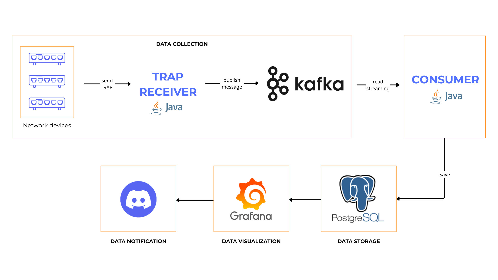
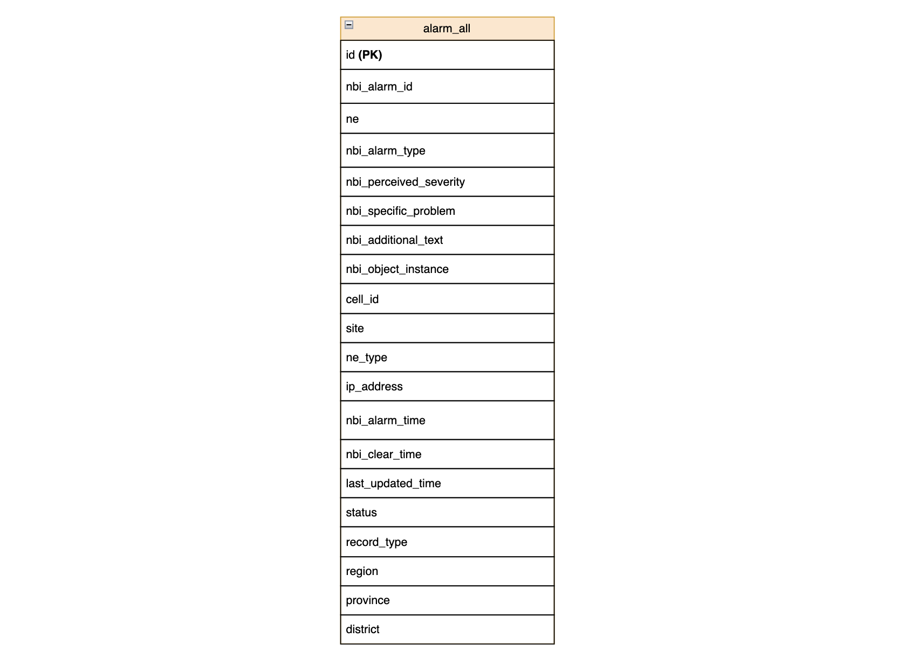
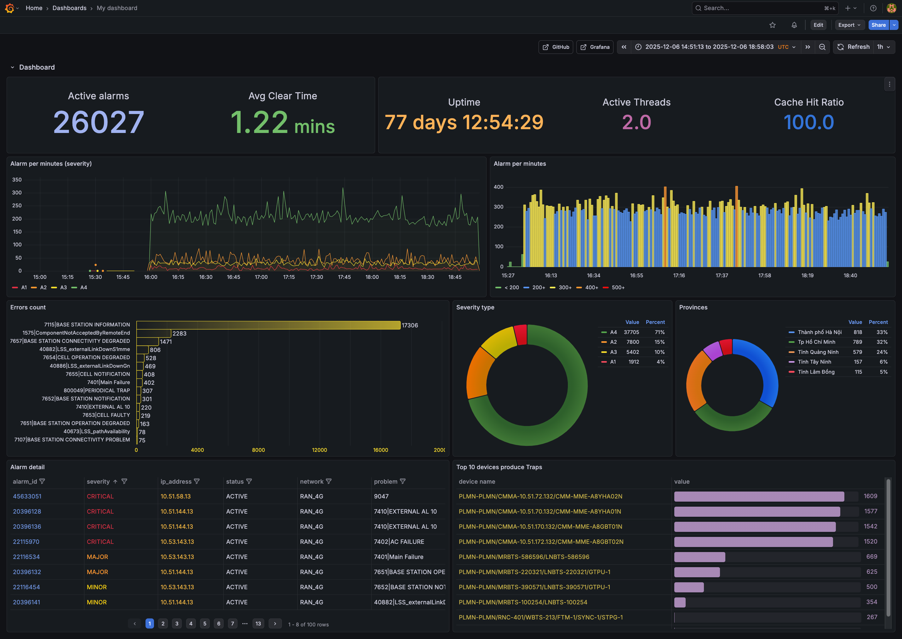

# SNMP Trap Alarm System 🚨 
> Hệ thống xử lý bản tin SNMP Trap phát sinh từ thiết bị mạng viễn thông, lưu trữ, trực quan hoá, gửi cảnh báo tới người dùng

## Overview 📖
Trap là bản tin được thiết bị mạng chủ động gửi tới máy manager khi có sự cố xảy ra, qua giao thức ```SNMP```. Nhà mạng sử dụng dữ liệu này để xác định được thông tin của thiết bị đang gặp lỗi từ đó đưa ra phương hướng xử lý.

Trap không ổn định mà nó có yếu tố bùng phát **(Trap storm)** khi hệ thống gặp lỗi nghiêm trọng. Dự án này xây dựng một pipeline xử lý bất đồng bộ, sử dụng **Kafka** làm vùng đệm, các **hàng đợi nội bộ** để giảm tải và **batch processing** khi lưu trữ vào database.

## Project Structure 📂
```text
alarm-system/
│── pom.xml                   # Maven config
│── src/
│   ├── main/java/com/
│   │   ├── consumer/
│   │   │   ├── kafkaConsumer/    # Kafka consumer
│   │   │   ├── model/            # model data
│   │   │   ├── test/             # test DB utils
│   │   │   ├── trap/             # Handling and Saving
│   │   │   └── util/             # DB utils
│   │   ├── producer/
│   │   │   ├── app/              # Application entry point
│   │   │   ├── common/           # Common constants & config
│   │   │   ├── kafkaProducer/    # Kafka producer
│   │   │   ├── model/            # Data models
│   │   │   ├── trap/             # Trap receiver
│   │   │   └── util/             # DB utils
│   └── test/java/            
│── target/                   # Build output
│── config/                   # config files
│── docker-compose.yml        # Docker compose file
│── README.md
```

## Data source 💻
- Trap data: dữ liệu Trap phát sinh từ thiết bị mạng của nhà mạng Mobifone, đây là bộ dữ liệu test được sử dụng để kiểm thử hệ thống
- Mapping data: dữ liệu các trạm phát sóng của Mobifone để thực hiện mapping
- Gửi và nhận: Trong thực tế Trap được gửi qua UDP Socket, hệ thống cũng mô phỏng quá trình gửi và nhận qua giao thức này
- Thời gian: 06/12/2025 - 07/12/2025
  
## System Architecture 🏗️



### 1. Data collection and Data Processing 📊
- Trap Receiver được viết bằng Java, lắng nghe Trap gửi về qua UDP socket
- Dữ liệu Trap được parse, làm giàu dữ liệu rồi gửi lên Kafka
  
### 2. Data Storage 💻
- Consumer đọc data từ Kafka sau đó phân loại bản tin theo network (3G, 4G, Core) và đẩy vào 3 hàng đợi riêng biệt
- Khởi tạo 3 luồng xử lý song song lấy data từ 3 hàng đợi và gọi procedure để lưu vào DB

### 3. Data Visulization and Alerting 🎥
- Sử dụng Grafana để vẽ dashboard
- Dùng Grafana Alerting thiết lập luật cảnh báo và gửi tới Discord khi thoả mãn điều kiện

## Data Storage Flow 🌊


## Entity Relation Diagram 


## Dashboard (Grafana) ✅


## Grafana Alerting 🚨
* Thiết lập 5 luật cảnh báo (Alert rules) tương ứng với 5 mã lỗi của thiết bị mạng Nokia.
* Đây là 5 mã lỗi ảnh hưởng đến cáp quang, đường truyền, nguồn điện, dẫn tới gián đoạn trải nghiệm người dùng ngay lập tức, vì thế cần gửi cảnh báo để nhà mạng phân công người tới xử lý.
* Các điều kiện cảnh báo được thiết lập để mã lỗi tồn tại quá 5 phút mới gửi cảnh báo tới Discord để chống spam


* Khi thoả mãn một trong các điều kiện cảnh báo, Grafana sẽ gửi cảnh báo tới người dùng thông qua kênh Discord với nội dung như sau:


## Key features 🎯
**1. Khả năng chịu tải và xử lý song song:** Sử dụng hàng đợi nội bộ, đặt ở những điểm dễ bị nghẽn (giữa TrapReceiver và Kafka, giữa Consumer và PostgreSQL) giúp hệ thống chịu tải tốt hơn

**2. Batch Processing:** Vì Update là thao tác chạy tốn thời gian hơn Insert nên Update sẽ được gom tới khi đủ 100 câu mới thực thi --> tối ưu hơn.

**3. Gửi cảnh báo:** Thiết lập các luật cảnh báo cho 1 vài mã lỗi nghiêm trọng (cáp quang, nguồn điện, mất kết nối,...) khi thoả mãn điều kiện sẽ gửi cảnh báo tới user.

## Setup 💻
### 🛠️ Yêu cầu hệ thống
Trước khi chạy, đảm bảo máy bạn đáp ứng những yêu cầu sau:
* **Java:** Version 17 hoặc cao hơn
* **Maven (Quản trị dự án):** Maven 3.8+.
* **Message Broker:** Apache Kafka & Zookeeper.
* **Database:** PostgreSQL 14+.
* **Visualization:** Grafana

> **Cài đặt Kafka, Kafka UI, Zookeeper, Grafana:** cài trên **Docker**
```text
docker-compose up -d
```
> **Cài đặt Maven**
```text
brew install maven      # For MacOS
```
### 💾 Chuẩn bị
- Tạo topic alarm-snmp trên Kafka
- Tạo bảng alarm.alarm_all trong PostgreSQL 
- Tạo procedure insert_alarm_all và update_alarm_all trong PostgreSQL
### 🚀 Cách thức chạy
Mở 3 terminal khác nhau để chạy các thành phần của hệ thống
> Compile project bằng maven để tải các dependencies về máy:
```text
mvn clean compile
```
> Khởi động TrapReceiver lắng nghe TRAP gửi qua port 1234 UDP SOCKET và đẩy lên Kafka
```text
mvn exec:java -Dexec.mainClass=com.producer.trap.TrapReceiver
```   
> Khởi động TrapSender gửi Trap tới port 1234 (localhost) UDP SOCKET
```text
mvn exec:java -Dexec.mainClass=com.producer.trap.TrapSender
```
> Khởi động TrapObs để poll dữ liệu từ Kafka và lưu DB
```text
mvn exec:java -Dexec.mainClass=com.consumer.trap.TrapObs
```


